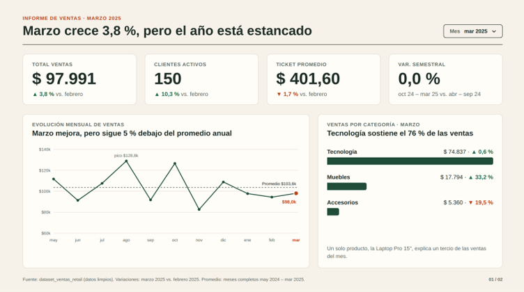
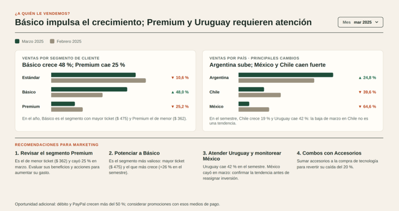
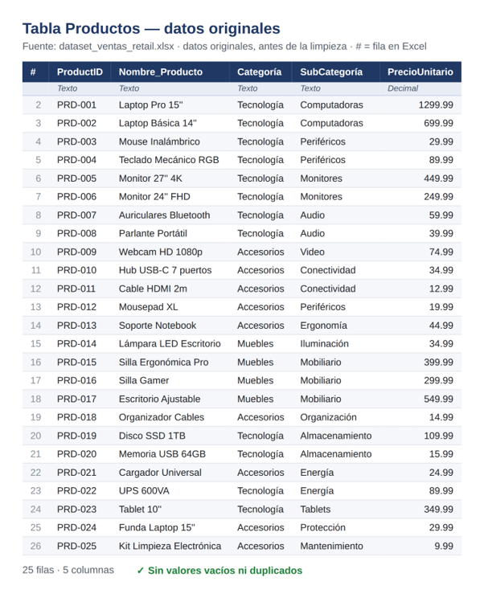
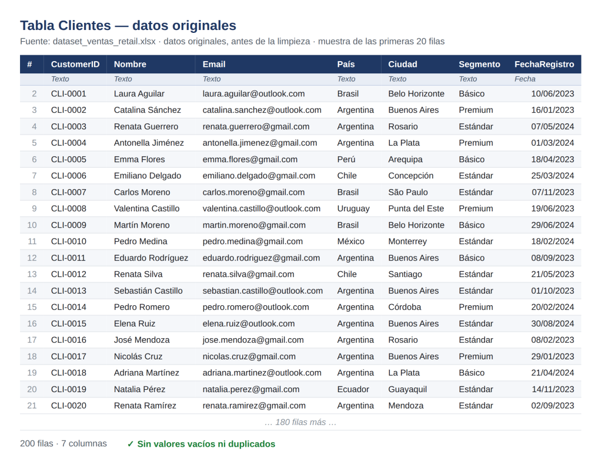
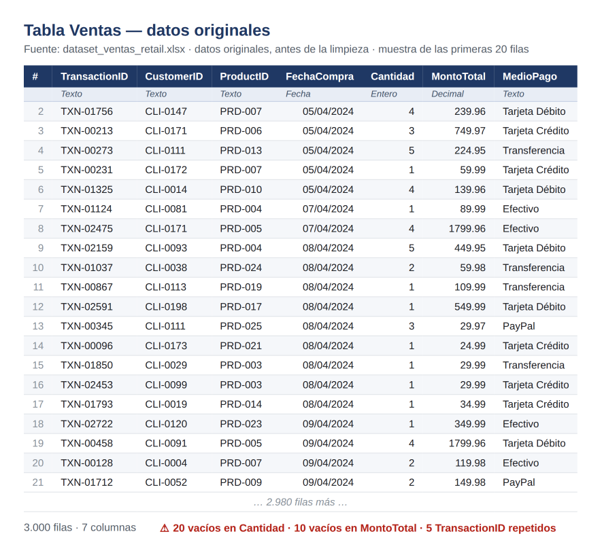
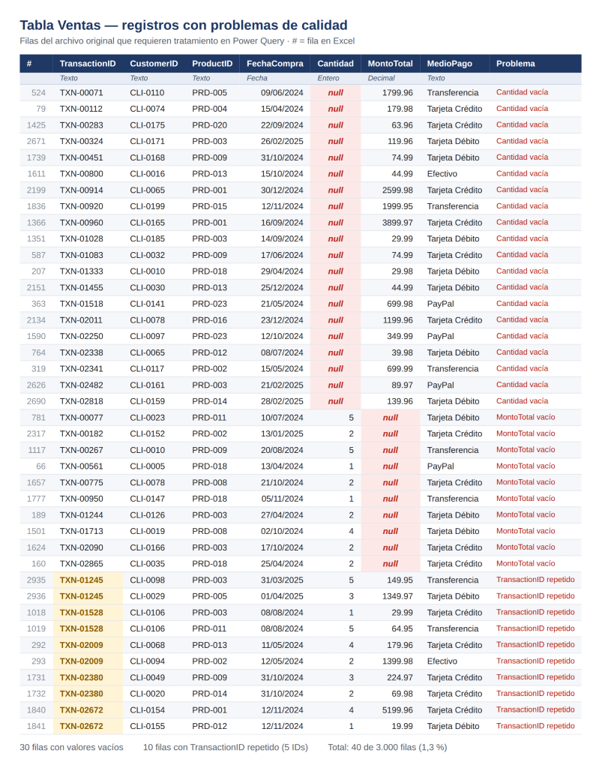
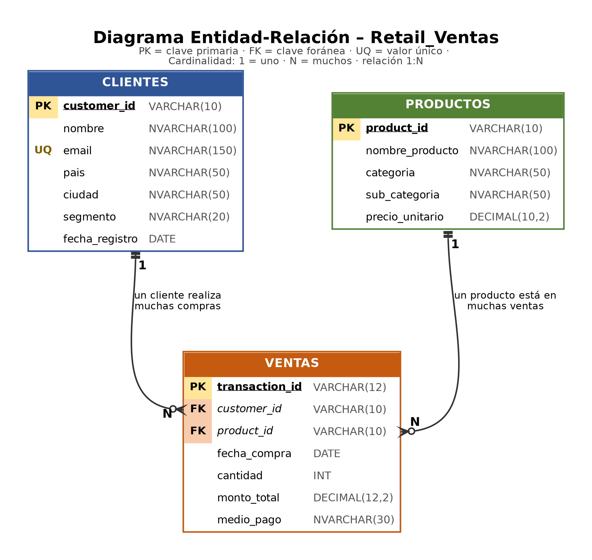
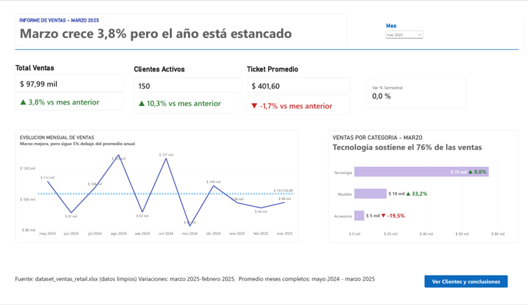
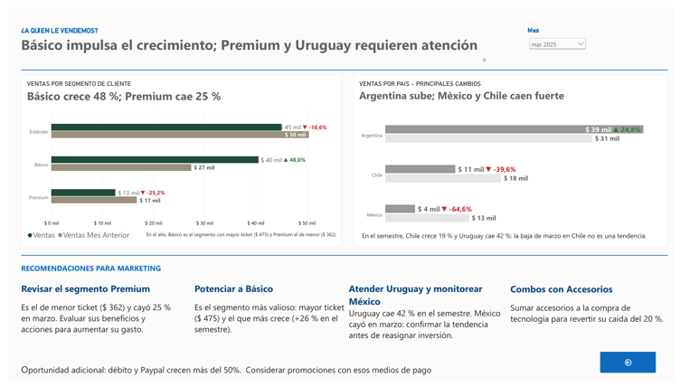

# Análisis de ventas retail con SQL Server y Power BI

Análisis de punta a punta de un año de ventas de una empresa retail con presencia en 8 países de Latinoamérica: limpieza de datos en Power Query, modelado relacional en SQL Server, análisis exploratorio y un dashboard en Power BI orientado a decisiones de marketing.




---

## Pregunta de negocio

> ¿Cómo se desempeñaron las ventas en el último mes frente a la tendencia del año, y en qué productos, segmentos y mercados debería enfocar marketing sus acciones?

## Hallazgos principales

- **Negocio estancado:** el último semestre (oct 2024 – mar 2025) vendió lo mismo que el anterior (**0,0 %**). Marzo 2025 creció **+3,8 %** contra febrero, pero sigue **5 % por debajo** del promedio mensual ($ 103.555).
- **Más clientes, compras más chicas:** en marzo crecieron los clientes activos (**+10,3 %**) y bajó el ticket promedio (**−1,7 %**).
- **Alta concentración:** Tecnología genera el **80,6 %** de los ingresos y un solo producto (Laptop Pro 15'') explica el **34,6 %**.
- **El segmento más valioso no es Premium:** Básico tiene el mayor ticket ($ 475) y es el que más crece (+26 % semestral); Premium tiene el menor ticket ($ 362).
- **Mercados:** Uruguay muestra la caída más fuerte y sostenida (**−42 %** semestral); Chile crece **+19 %**.

## Herramientas

| Etapa | Herramienta |
|---|---|
| Limpieza y transformación | Power Query (Power BI) |
| Modelo relacional y consultas | SQL Server · T-SQL |
| Medidas y visualización | Power BI · DAX |

## Dataset

Datos de ventas de una empresa retail ficticia, provistos en un archivo Excel con 3 tablas:

| Tabla | Registros | Contenido |
|---|---|---|
| Ventas | 3.000 | Transacción, cliente, producto, fecha, cantidad, monto y medio de pago |
| Clientes | 200 | Nombre, email, país, ciudad, segmento y fecha de registro |
| Productos | 25 | Nombre, categoría, subcategoría y precio unitario |

**Período:** 05/04/2024 al 07/04/2025. Abril 2024 y abril 2025 están incompletos y se excluyen de los promedios mensuales.

---

## Proceso

### 1. Limpieza de datos (Power Query)

Problemas detectados en la tabla Ventas y cómo se resolvieron:

| Problema | Registros | Solución |
|---|---|---|
| `cantidad` vacía | 20 | Recalculada como `monto_total ÷ precio_unitario` (combinando con Productos) |
| `monto_total` vacío | 10 | Recalculado como `cantidad × precio_unitario` |
| `transaction_id` repetido | 5 IDs (10 filas) | Eran ventas distintas: se conservó el ID en la más antigua y se asignó un ID nuevo (TXN-03001 a TXN-03005) a la más reciente, sin perder ventas |
| Nombres de columnas inconsistentes | — | Renombradas a formato snake_case (`TransactionID` → `transaction_id`) |










### 2. Modelo de datos (SQL Server)

Esquema estrella con **Ventas** como tabla de hechos y relaciones 1:N con **Clientes** y **Productos**.



El script [`01_crear_tablas_y_cargar_datos.sql`](sql/01_crear_tablas_y_cargar_datos.sql) crea las tablas con claves primarias, foráneas y restricciones de validación, y carga los datos limpios.

### 3. Análisis exploratorio

Consultas en [`03_analisis_exploratorio.sql`](sql/03_analisis_exploratorio.sql). Principales observaciones:

- La mayoría de las ventas son de 1 o 2 unidades; el monto tiene sesgo a la derecha (mediana $ 105, media $ 417) por las ventas de productos caros.
- Tecnología representa el 56 % de las transacciones pero el 81 % del monto; Accesorios, un tercio de las transacciones y solo el 6 % del monto.
- 296 ventas (9,9 %) tienen fecha anterior al registro del cliente: inconsistencia documentada, sin impacto en los montos.

### 4. Consulta: ventas de los últimos 30 días

[`02_ventas_ultimos_30_dias.sql`](sql/02_ventas_ultimos_30_dias.sql) devuelve cliente, fecha y total de las ventas de los últimos 30 días, ordenadas por fecha descendente.

- **Fecha de referencia:** la última venta del dataset (07/04/2025), ya que los datos son históricos.
- **Rango:** 30 fechas calendario, del 09/03/2025 al 07/04/2025 inclusive. **Resultado: 250 filas.**


### 5. Dashboard (Power BI)

Dos páginas con una segmentación por mes sincronizada y botones de navegación, siguiendo la estructura narrativa **qué pasó → por qué → qué hacemos**:

| Página | Contenido |
|---|---|
| **¿Cómo nos fue?** | KPIs del mes con variación vs. mes anterior y variación semestral · evolución mensual con línea de promedio · ventas por categoría |
| **¿A quién le vendemos y qué hacemos?** | Ventas por segmento y por país (mes actual vs. anterior) · recomendaciones para marketing |




Las medidas DAX (variación mensual, variación semestral, ticket promedio y formato condicional) están documentadas en [`medidas_dax.md`](powerbi/medidas_dax.md).

---

## Recomendaciones para marketing

1. **Potenciar el segmento Básico:** campañas de retención y venta cruzada en el segmento que más gasta y más crece.
2. **Revisar el segmento Premium:** evaluar sus beneficios y criterios de segmentación para aumentar su ticket.
3. **Diversificar la oferta:** combos de Tecnología + Accesorios e impulso a Muebles (+24 % semestral) para reducir la dependencia de la Laptop Pro.
4. **Atender Uruguay:** investigar las causas de su caída sostenida antes de reasignar inversión.

## Limitaciones

- El dataset cubre un año: no permite comparar interanualmente ni medir estacionalidad.
- No incluye costos ni márgenes: el análisis se basa en ingresos, no en rentabilidad.
- Cada venta registra un único producto.

---

## Estructura del repositorio

```
├── README.md
├── data/
│   └── dataset_ventas_retail.xlsx
├── sql/
│   ├── 01_crear_tablas_y_cargar_datos.sql
│   ├── 02_ventas_ultimos_30_dias.sql
│   └── 03_analisis_exploratorio.sql
├── powerbi/
│   ├── dashboard_ventas.pbix
│   └── medidas_dax.md
├── images/
│   └── capturas del proceso y del dashboard
└── docs/
    └── informe_completo.pdf
```

## Cómo reproducirlo

1. Ejecutar `sql/01_crear_tablas_y_cargar_datos.sql` en SQL Server para crear y cargar las tablas.
2. Ejecutar las consultas de `sql/02` y `sql/03`.
3. Abrir `powerbi/dashboard_ventas.pbix` con Power BI Desktop. Si los datos no cargan, actualizar la ruta del origen en **Transformar datos → Configuración de origen de datos**.

---

**María Cristina Gaupmann** · QA Analyst & Senior Systems Analyst
[LinkedIn](https://www.linkedin.com/in/maria-cristina-gaupmann/) · Proyecto final del curso de Data Analytics
